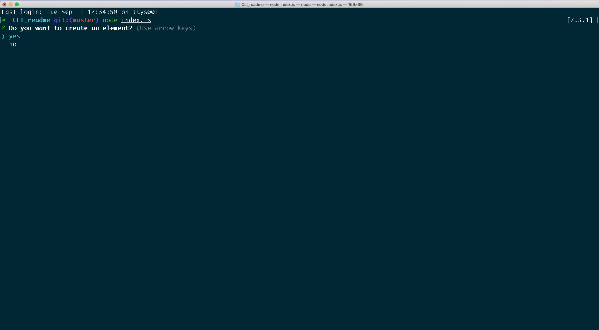
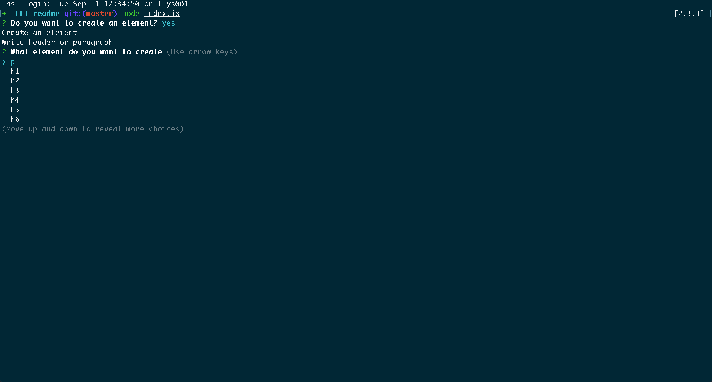
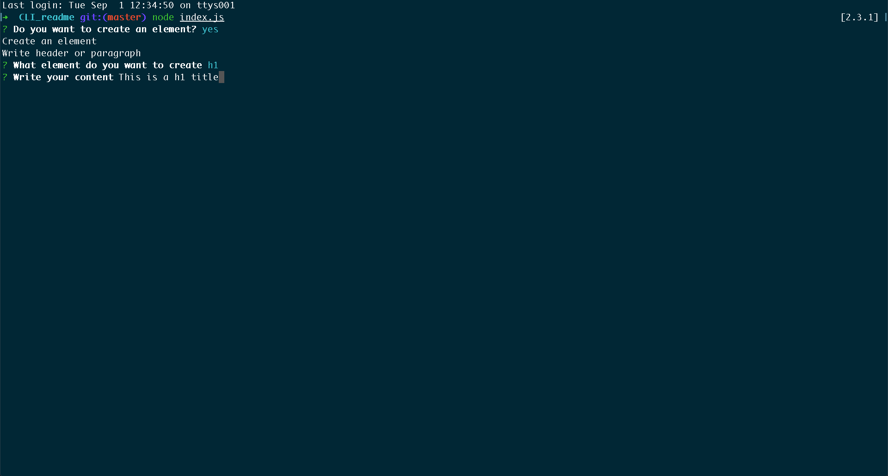
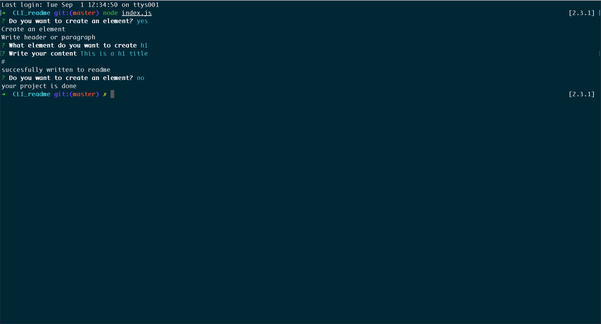
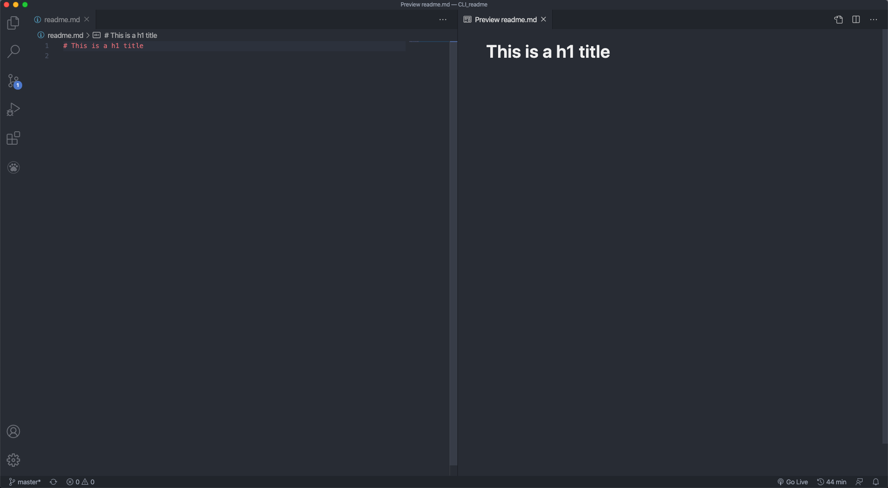

# CLI Readme Generator
## Description
 This application allows the user to create a clean readme file through the terminal. While writing good readme file is important, it often takes the developer out of its flow. This command-line interface readme generator allows to quickly generate the readme while staying in the terminal. It generates automatically the appropriate markdown syntax, resulting in a clean, organised file. 

## Table of Contents
* [Installation](#installation)
* [Usage](#usage)
* [Good Practice](#good_practice)
* [License](#license)
## Installation
 Download the zip file or clone the project to your machine. Then run npm install to download the dependencies. 
 
```terminal   
npm install  
``` 







## Usage
 To run the application, answer 'yes' to the question: 'Create a new element?'. Then, chose the element you want to create. 
 Then, input your content. Repeat the process to create as many elements you want. To end the application, answer 'no' to the question: 'Create a new element?'. The element are automatically converted into markdown syntax. Your content is appended to the readme.md file as you create it.


## Good Practice
 In order to create a clean table of content, create a 'ul' (unordered list) element. Input your content with the markdown syntax for anchor links: \[example](#example).


## License
 MIT License
 Copyright (c) [2020] [Pierre Pariente Dimitrov]


## Badge
 
 

## Contributing
 Learn more by reading the [Contributor Covenant](./CODE_OF_CONDUCT.md) file.
